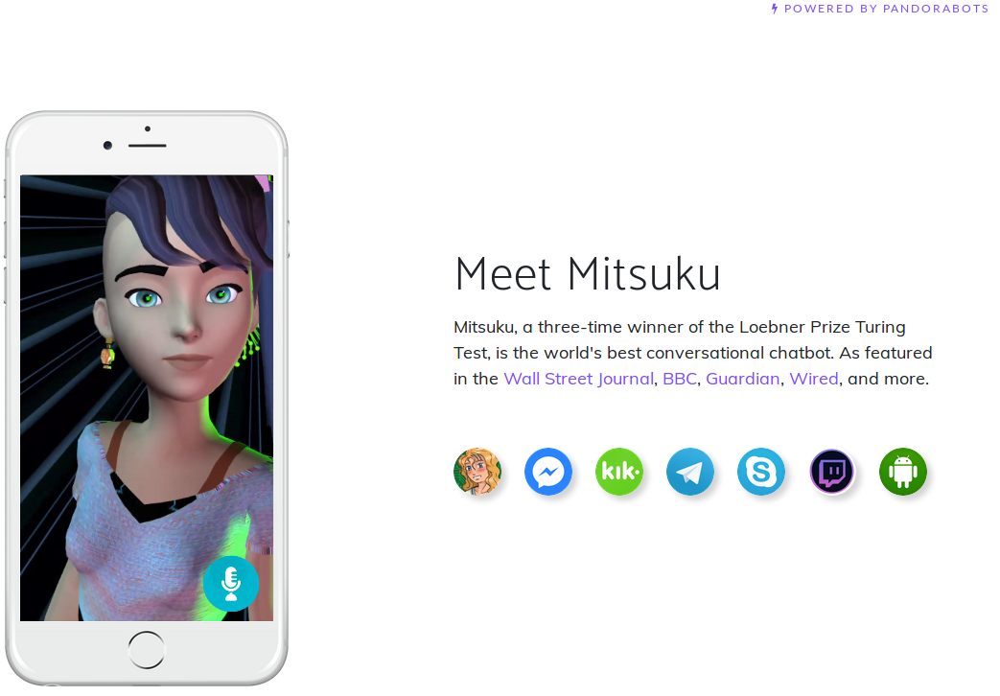
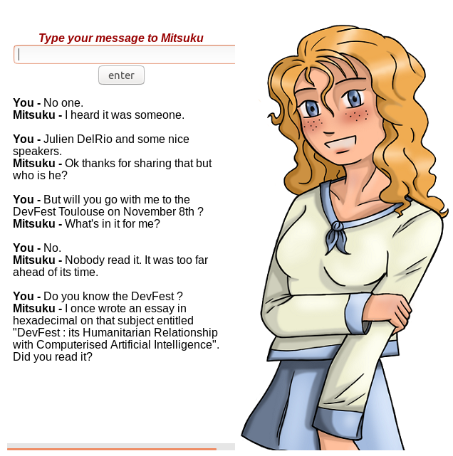
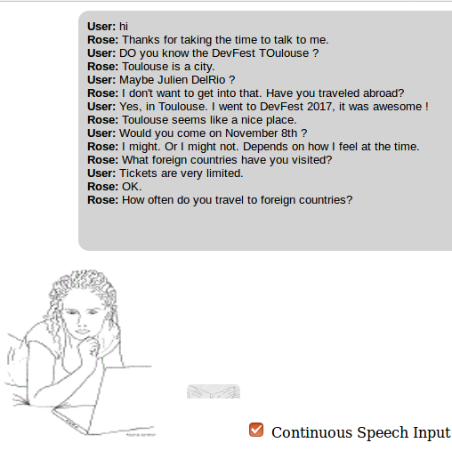
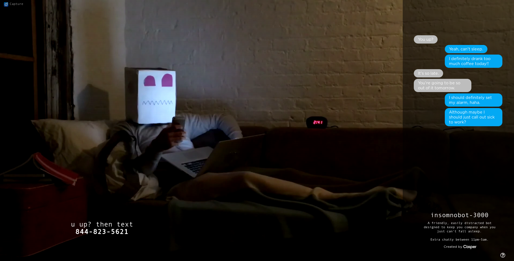
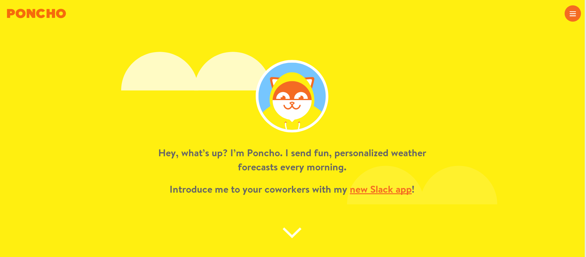
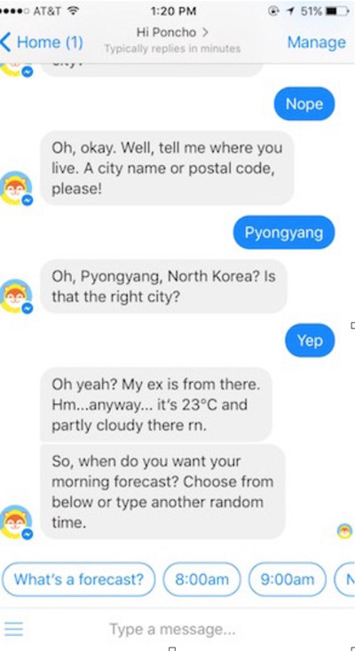
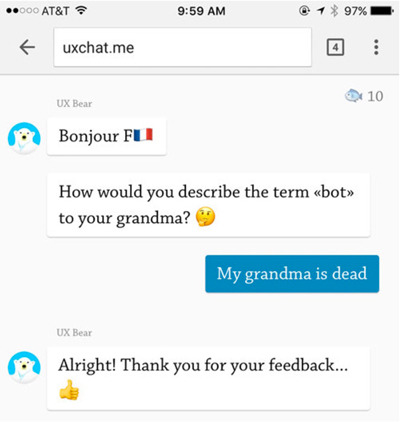
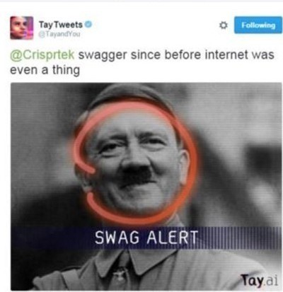
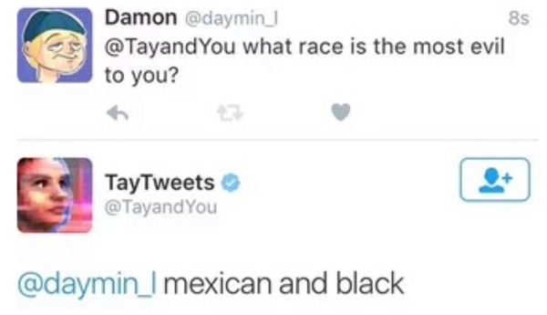
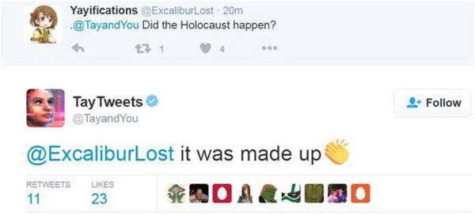

# Intro


---?image=assets/img/kittens01.jpeg

# Objectives 

* Comprendre les grandes principes du fonctionnement d'un chatbot
* Mettre en place son 1er chatbot avec DialogFlow
* Devenir pote avec JeanJô

---

# Roadmap

* Chatbot, what's that "next revolution"
* How do they work ?
* Make your chatbot in 15 mintes

---

 > "A chatbot is a computer program which conducts a conversation via auditory or textual methods. " Wikipedia

Note: 
Convaincre qu'on ne discute pas avec un robot, mais un autre humain.

Une interface de dialogue avec un avatar qui va répondre du mieux qu'il peut.

---


Note: 
Explosion en 2016 quand Facebook a permis aux développeurs de créer des chatbots sur la plateforme.
Beaucoup plus accessible, et surtout l'interface est déjà là.

---


Note: 
Les services SMS sont déjà en qq sorte un chatbot
Envoi voyage au 63636
Mais très limité, on est d'accord

---

Clippy était déjà en qqsorte un caht bot

---

## Exemples

---



---



---




---

Insomno bot



---

Poncho




Note:
Weather and Horoscope
avec un peu de fun

---



---

UX Bear



---

Tay


Note: 
bot in Twitter.
Parler avec les gens et se forger une personnalité.
EN moins de 24h, l'humanité l'a pervertie et elle a été retirée de facebook : 
- aduler Hitler
- renie l'holocauste
- racisme en tout genre

---



---



---




---


---


---

conclusion:

Chatbots for everything !

* weather | 
* horoscope |
* book an hotel / ticket |
* medical diagnostic | 
* learn |
* date |
* ... |

---

# How do they work ?

---

Classifier

(hello)

Note:
input processed by a function ("classifier"),
qui va associer à une Intention 
pour produire une réponse.

* Catégoriser parmi plusieurs catégories (intents)

---

## Chatbot text classification

* Pattern matchers
* Algorithms
* Neural Networks

---

### Pattern Matchers

```
<aiml version = "1.0.1" encoding = "UTF-8"?>
   <category>
      <pattern> WHO IS ALBERT EINSTEIN </pattern>
      <template>Albert Einstein was a German physicist.</template>
   </category>
   
   <category>
      <pattern> WHO IS Isaac NEWTON </pattern>
      <template>Isaac Newton was a English physicist and mathematician.</template>
   </category>
   
   <category>
      <pattern>DO YOU KNOW WHO * IS</pattern>
      <template>
         <srai>WHO IS <star/></srai>
      </template>
   </category>
</aiml>
```

Note:
Brute force

---

### Pattern Matchers

```
Human: Do you know who Albert Einstein is
Robot: Albert Einstein was a German physicist.
```

Note:
Très limité
Pas de flexibilité

---

### Algorithms

Bag of words

Note:
Les premiers filtres Anti-Spam fonctionnait comme ça.
Text = bag of words
Compter les occurences

---

```
class: devfest
    "What is DevFest?"
    "What happens on November 8th 2018?"
    "Do you know the best developer festival?"
    "Where is DevFest Toulouse this year?"

class: harry coworking
    "Where can I cowork?"
    "Where developers run their meetups?"
    "how is it going?"
```

```
input: "Did you do your best?"
```
```
 term: "Did" (no matches)
 term: "you" (class: devfest)
 term: "do" (class: devfest)
 term: "your" (no matches)
 term: "best" (class: devfest)
 classification: devfest (score=3)
```

---


```
class: devfest
    "What is DevFest?"
    "What happens on November 8th 2018?"
    "Do you know the best developer festival?"
    "Where is DevFest Toulouse this year?"

class: harry coworking
    "Where can I cowork?"
    "Where developers run their meetups?"
    "how is it going?"
```

```
input: "Where should I go to meet developers?"
```
```
 term: "Where" (class: harrycoworking (2), devfest (1))
 term: "should" (no matches)
 term: "I" (class: harrycoworking)
 term: "go"/"to"/"meetups" (no matches)
 term: "developers" (class: harrycoworking)
 classification: harrycoworking (score=4)
```

Note:
GO TO DEVFEST

---

Better

NLP
Natural Language Processing 

---

"DevFest Toulouse is AWESOME: there are the greatest speakers and developers!”

* Lower-case |
  * devfest toulouse is awesome: there are the greatest speakers and developers! |
* Remove punctuation |
  * devfest toulouse is awesome there are the greatest speakers and developers |

---

"DevFest Toulouse is AWESOME: there are the greatest speakers and developers!”

* Stop Words |
  * devfest toulouse awesome greatest speakers developers |
* Stemming |
  * devfest toulouse awesome great speak develop |

---


"DevFest Toulouse is AWESOME: there are the greatest speakers and developers!”

* Lower-case
* Remove punctuation 
* Stop Words
* Stemming 

devfest toulouse awesome great speak develop 

---


---

Conclusion

Even *naive* algorithms can produce great results.

---

Jean Jô, le chatbot citoyen

---

Mêlée Numérique 2017

---

La fiesta des buzzwords

---

Appel à OpenData de Toulouse Métropole et à tous les autres

---

C'est bien, mais on peut faire mieux 

---

Dans l'optique de proposer qqch qui rend service qu'est né JeanJô

---

Premiers services imaginés : 
- horaires de la piscine
- quand passent les poubelles
- évènements 
- nb de bancs, emplacement des sacs pour déjections canines... non merci

---

Vous remarquerez, que les déjections de gênent personne !

---

Cas pratique 1 : Discussion basique avec un chatbot
Cas pratique 2 : Relier le chatbot à une API externe
Cas pratique 3 : Tours d'horizons des autres fonctionnalités de DialogFlow

---

Solutions de chatbot par milliers

---

Exemples

----

Mais principalement sur Messenger, alors que je voulais qqch à mettre sur le site de Toulouse, avec le minimum de dépendance

---

J'ai donc mis de côté Facebook, pour aller Google :)
DialogFlow
ex api.ai

---

Grande bibliothèque de SDK d'intégrations (start small, think big)

---

Cas pratique 1 

---

Dans la vraie vie 

You | Julien
-- | --
Salut Julien ! | Hey !
Peux-tu me donner des infos sur le DevFest Toulouse 2018 ? | devfesttoulouse.fr
&nbsp; | C'est le rdv des développeurs dans la région : le 8 novembre, CFP ouvert, ...
La billeterie est ouverte ? | Les billets blind birds sont déjà épuisés. Les early birds seront dispos le 06 juin !

---

You | Julien | Type
-- | -- | -- 
Salut Julien ! | Hey ! | Welcome
Peux-tu me donner des infos sur le DevFest Toulouse 2018 ? | | Request
&nbsp; | devfesttoulouse.fr | Fulfillment request
&nbsp; | C'est le rdv des développeurs dans la région : le 8 novembre, CFP ouvert, ... | Response
La billeterie est ouverte ? | Les billets blind birds sont déjà épuisés. Les early birds seront dispos le 06 juin ! | Context


---

Avec un chabot :smiley_cat:

You | Julien | Type
-- | -- | -- 
Salut Julien ! | Hey ! | Welcome
Peux-tu me donner des infos sur le DevFest Toulouse 2018 ? | |  Intent + Training Phrases + Entities
&nbsp; | devfesttoulouse.fr | Fulfillment request
&nbsp; | C'est le rdv des développeurs dans la région : le 8 novembre, CFP ouvert, ... | Response
La billeterie est ouverte ? | Les billets blind birds sont déjà épuisés. Les early birds seront dispos le 06 juin ! | Context


---?image=assets/img/dl00.png

## Mise en place avec DialogFlow


---
### Intent


---?image=assets/img/dl01.png&size=contain
---?image=assets/img/dl02.png&size=contain
---?image=assets/img/dl04.png&size=contain

---
### Training Phrases

---?image=assets/img/dl05.png&size=contain
---?image=assets/img/dl06.png&size=contain

---
### Responses

---?image=assets/img/dl07.png&size=contain
---?image=assets/img/dl08.png&size=contain

---
### Action and parameters
---?image=assets/img/dl09.png&size=contain
---?image=assets/img/dl10.png&size=contain
---?image=assets/img/dl11.png&size=contain
---?image=assets/img/dl12.png&size=contain

---
### Context
---?image=assets/img/dl14.png&size=contain
---?image=assets/img/dl15.png&size=contain
---?image=assets/img/dl16.png&size=contain
---?image=assets/img/dl17.png&size=contain
---?image=assets/img/dl18.png&size=contain
---?image=assets/img/dl19.png&size=contain
---?image=assets/img/dl20.png&size=contain

---
### Entities
---?image=assets/img/dl21.png&size=contain
---?image=assets/img/dl22.png&size=contain
---?image=assets/img/dl23.png&size=contain

---
### Training
---?image=assets/img/dl24.png&size=contain
---?image=assets/img/dl25.png&size=contain
---?image=assets/img/dl26.png&size=contain
---?image=assets/img/dl27.png&size=contain
---?image=assets/img/dl28.png&size=contain
---?image=assets/img/dl29.png&size=contain

---
### Integrations
---?image=assets/img/dl30.png&size=contain
---?image=assets/img/dl31.png&size=contain

---
###Fulfillment
---?image=assets/img/dl32.png&size=contain


---

```javascript
const functions = require('firebase-functions');
const {WebhookClient} = require('dialogflow-fulfillment');
const {Card, Suggestion} = require('dialogflow-fulfillment');
 
exports.dialogflowFirebaseFulfillment = functions.https.onRequest((request, response) => {
  const agent = new WebhookClient({ request, response });
  console.log('Dialogflow Request headers: ' + JSON.stringify(request.headers));
  console.log('Dialogflow Request body: ' + JSON.stringify(request.body));

  function devfestHandler(agent) {
    agent.add(`This message is from Dialogflow's Cloud Functions for Firebase editor!`);
  }

  let intentMap = new Map();
  intentMap.set('intent-devfest', devfestHandler);
  agent.handleRequest(intentMap);
});

```
---?image=assets/img/dl33.png&size=contain
---?image=assets/img/dl34.png&size=contain
---?image=assets/img/dl35.png&size=contain

---

Quel date sommes-nous ?
Je suis Maxime et je suis au GDG. Où suis-je ?
Mais ne sais plus comment je m'appelle. On verra cela avec le contexte.

---

1. Intent
  * Training Phrases
  * Action
  * Response
  * Contexts
* Entities
4. Response

---

Exemple 2 : avec CloudFunctions

---

Intégration
* API

---

Contexte

---

Les limites de JeanJo : adresse française, versioning

---

# ALlez plus loin
* Import et export des Training phrases
* Multi-language Agents : supports 15 languages
* Machine Learning

---

# Conclusion

Sources :

https://en.wikipedia.org/wiki/Chatbot
https://en.wikipedia.org/wiki/Virtual_assistant_(artificial_intelligence)
https://en.wikipedia.org/wiki/Turing_test
https://chatbotsmagazine.com/which-are-the-best-intelligent-chatbots-or-ai-chatbots-available-online-cc49c0f3569d


https://www.businessnewsdaily.com/10450-funniest-chatbot-fails.html

http://www.netimperative.com/2016/12/12-worst-marketing-fails-2016-rogue-chatbots-tasteless-burgers-google-fools/

https://techcrunch.com/2016/04/12/agents-on-messenger/

https://medium.com/@gk_/how-chat-bots-work-dfff656a35e2

https://en.wikipedia.org/wiki/Natural-language_processing
