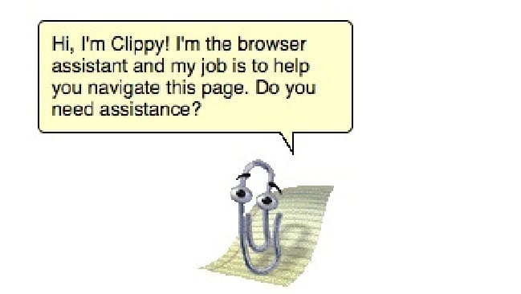
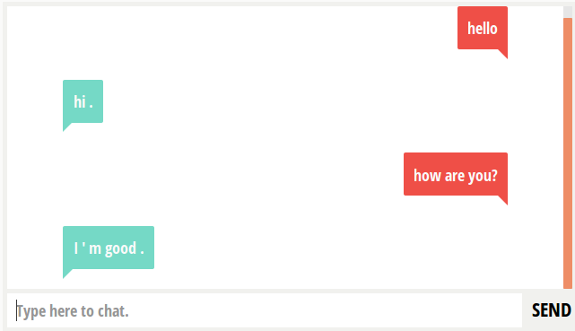
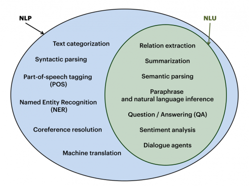
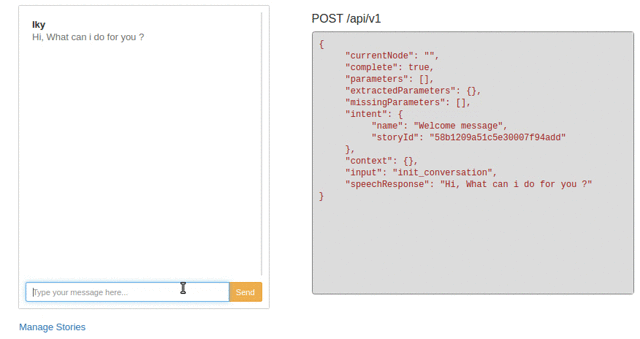
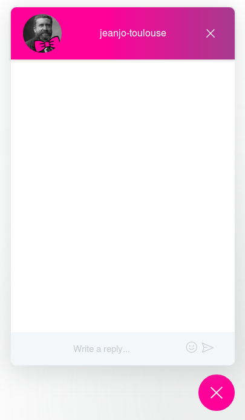

## 😺 Minou Minou 😺 ! Les chat(bot)s continuent leur invasion de l'INTERNET

Maxime PAWLAK - GDG ChatBot - S02E07 - Jeudi 12 avril 2018

---?image=assets/img/kittens01.jpeg&size=contain

## Objectives 

* Understand the big picture of chatbot
* Deploy our 1st chatbot with DialogFlow

---?image=assets/img/cat01.jpeg&size=contain

## Roadmap

* Chatbot, what's that "next revolution"
* Futur is coming
* How do they work ?
* Make your chatbot in 15 mintes

---?image=assets/img/cat02.jpg&size=contain

# Part 1 - Chabot
-----

---?image=assets/img/wiki.png&size=contain

 > "A chatbot is a computer program which conducts a conversation via auditory or textual methods. " Wikipedia

Note: 
Convaincre qu'on ne discute pas avec un robot, mais un autre humain.

Une interface de dialogue avec un avatar qui va répondre du mieux qu'il peut.

---?image=assets/img/nature_interface.jpg&size=contain

## Interface

---


Note: 
Explosion en 2016 quand Facebook a permis aux développeurs de créer des chatbots sur la plateforme.
Beaucoup plus accessible, et surtout l'interface est déjà là.

---


Note: 
Les services SMS sont déjà en qq sorte un chatbot
Envoi voyage au 63636
Mais très limité, on est d'accord

---



---

## Exemples

---


---


---


---

Insomno bot


---

Poncho


Note:
Weather and Horoscope
avec un peu de fun

---


---

UX Bear


---

Tay


Note: 
bot in Twitter.
Parler avec les gens et se forger une personnalité.
EN moins de 24h, l'humanité l'a pervertie et elle a été retirée de facebook : 
- aduler Hitler
- renie l'holocauste
- racisme en tout genre

---


---


---


---


---


---?image=assets/img/cat04.jpeg&size=contain

#### Chatbots for everything !

* weather | 
* horoscope |
* book an hotel / ticket |
* medical diagnostic | 
* learn |
* date |
* ... |

---?image=assets/img/cat03.jpeg&size=contain

# Part 2 - How do they work ?
----

---

Classifiers



Note:
input processed by a function ("classifier"),
qui va associer à une Intention 
pour produire une réponse.

* Catégoriser parmi plusieurs catégories (intents)

---?image=assets/img/cat05.jpeg&size=contain

## Chatbot text classification

---

### Pattern Matchers

AIML : Artificial Intelligence Markup Language
```
<aiml version = "1.0.1" encoding = "UTF-8"?>
   <category>
      <pattern> WHO IS ALBERT EINSTEIN </pattern>
      <template>Albert Einstein was a German physicist.</template>
   </category>
   
   <category>
      <pattern> WHO IS Isaac NEWTON </pattern>
      <template>Isaac Newton was a English physicist and mathematician.</template>
   </category>
   
   <category>
      <pattern>DO YOU KNOW WHO * IS</pattern>
      <template>
         <srai>WHO IS <star/></srai>
      </template>
   </category>
</aiml>
```

Note:
Brute force

---

```
Human: Do you know who Albert Einstein is
Robot: Albert Einstein was a German physicist.
```

Note:
Très limité
Pas de flexibilité

---

### Algorithms

Bag of words

Note:
Les premiers filtres Anti-Spam fonctionnait comme ça.
Text = bag of words
Compter les occurences

---

```
class: devfest
    "What is DevFest?"
    "What happens on November 8th 2018?"
    "Do you know the best developer festival?"
    "Where is DevFest Toulouse this year?"

class: harry coworking
    "Where can I cowork?"
    "Where developers run their meetups?"
    "how is it going?"
```

```
input: "Did you do your best?"
```
```
 term: "Did" (no matches)
 term: "you" (class: devfest)
 term: "do" (class: devfest)
 term: "your" (no matches)
 term: "best" (class: devfest)
 classification: devfest (score=3)
```

---

```
class: devfest
    "What is DevFest?"
    "What happens on November 8th 2018?"
    "Do you know the best developer festival?"
    "Where is DevFest Toulouse this year?"

class: harry coworking
    "Where can I cowork?"
    "Where developers run their meetups?"
    "how is it going?"
```

```
input: "Where should I go to meet developers?"
```
```
 term: "Where" (class: harrycoworking (2), devfest (1))
 term: "should" (no matches)
 term: "I" (class: harrycoworking)
 term: "go"/"to" (no matches)
 term: "meetups" (class: harrycoworking)
 term: "developers" (class: harrycoworking)
 classification: harrycoworking (score=4)
```

Note:
GO TO DEVFEST

---

### NLP

Natural Language Processing 


Note:
* area of computer science and artificial intelligence concerned with the interactions between computers and human (natural) languages
* translation 
* SPAM
* speech recognition
* natural-language understanding 
* natural-language generation
* Automatic summarization
* chatbot ...

---

> "Les mères poules couvent au couvent"

---

> "DevFest Toulouse is AWESOME: there are the greatest speakers and developers!”

* Lower-case |
* Remove punctuation |
* Stop Words |
* Stemming |
* > devfest toulouse awesome great speak develop |

---

#### NER

Named-entity recognition

Note: 
Reconnaissance_d'entités_nommées

---

> "J'ai mangé 1998 pommes golden le 23 mars 2018"

---

#### NLU

Natural language understanding

---



---?image=assets/img/watson.jpg&size=contain

Note:
* 2011 $1 million
*  This number, one of the first 20, uses only one vowel (4 times!). 
*  Seventeen

---?image=assets/img/mix.jpeg&size=contain


---?image=assets/img/cat06.jpeg&size=contain

# Part 3 - Futur ?

---?image=assets/img/futur.jpg&size=contain

---?image=assets/img/ihm.jpeg&size=contain

## IHM

Note:
* Intéractions plus naturelles avec le numérique
* Evolution des IHM
  * Bouton physique
  * Terminal
  * Interface graphique
  * Chatbot : agent conversationnel

---

## Accessible

Note:
* Open-Source

---

## Accessible



"You don’t need to be an expert at artificial intelligence to create an awesome chatbot."

https://github.com/alfredfrancis/ai-chatbot-framework/

---?image=assets/img/rasa.png&size=contain

---


```python
from chatterbot import ChatBot

chatbot = ChatBot(
    'Ron Obvious',
    trainer='chatterbot.trainers.ChatterBotCorpusTrainer'
)

# Train based on the english corpus
chatbot.train("chatterbot.corpus.english")

# Get a response to an input statement
chatbot.get_response("Hello, how are you today?")
```


---

# Part 4 - Deploy my 1st chatbot

---

### Jean Jô


Note:
* Mêlée Numérique 2017
* La fiesta des buzzwords
* Appel à OpenData de Toulouse Métropole et à tous les autres

---




Note: 
Premiers services imaginés : 
- horaires de la piscine
- quand passent les poubelles
- évènements 
- nb de bancs, emplacement des sacs pour déjections canines... non merci

---

Quelles plateformes ?

Note:
* principalement sur Messenger, alors que je voulais qqch à mettre sur le site de Toulouse, avec le minimum de dépendance

---?image=assets/img/dialogflow.png&size=contain


Note: 
* mis de côté Facebook, pour aller Google :)
* Grande bibliothèque de SDK d'intégrations (start small, think big)

---

Cas pratique 1 

---

Dans la vraie vie 

You | Julien
-- | --
Salut Julien ! | Hey !
Peux-tu me donner des infos sur le DevFest Toulouse 2018 ? | devfesttoulouse.fr
&nbsp; | C'est le rdv des développeurs dans la région : le 8 novembre, CFP ouvert, ...
La billeterie est ouverte ? | Les billets blind birds sont déjà épuisés. Les early birds seront dispos le 06 juin !

---

You | Julien | Type
-- | -- | -- 
Salut Julien ! | Hey ! | Welcome
Peux-tu me donner des infos sur le DevFest Toulouse 2018 ? | | Request
&nbsp; | devfesttoulouse.fr | Fulfillment request
&nbsp; | C'est le rdv des développeurs dans la région : le 8 novembre, CFP ouvert, ... | Response
La billeterie est ouverte ? | Les billets blind birds sont déjà épuisés. Les early birds seront dispos le 06 juin ! | Context


---

Avec un 😺 chabot 😺

You | Julien | Type
-- | -- | -- 
Salut Julien ! | Hey ! | Welcome
Peux-tu me donner des infos sur le DevFest Toulouse 2018 ? | |  Intent + Training Phrases + Entities
&nbsp; | devfesttoulouse.fr | Fulfillment request
&nbsp; | C'est le rdv des développeurs dans la région : le 8 novembre, CFP ouvert, ... | Response
La billeterie est ouverte ? | Les billets blind birds sont déjà épuisés. Les early birds seront dispos le 06 juin ! | Context


---?image=assets/img/dl00.png

## Mise en place avec DialogFlow


---
### Intent


---?image=assets/img/dl01.png&size=contain
---?image=assets/img/dl02.png&size=contain
---?image=assets/img/dl04.png&size=contain

---
### Training Phrases

---?image=assets/img/dl05.png&size=contain
---?image=assets/img/dl06.png&size=contain

---
### Responses

---?image=assets/img/dl07.png&size=contain
---?image=assets/img/dl08.png&size=contain

---
### Action and parameters
---?image=assets/img/dl09.png&size=contain
---?image=assets/img/dl10.png&size=contain
---?image=assets/img/dl11.png&size=contain
---?image=assets/img/dl12.png&size=contain

---
### Context
---?image=assets/img/dl14.png&size=contain
---?image=assets/img/dl15.png&size=contain
---?image=assets/img/dl16.png&size=contain
---?image=assets/img/dl17.png&size=contain
---?image=assets/img/dl18.png&size=contain
---?image=assets/img/dl19.png&size=contain
---?image=assets/img/dl20.png&size=contain

---
### Entities
---?image=assets/img/dl21.png&size=contain
---?image=assets/img/dl22.png&size=contain
---?image=assets/img/dl23.png&size=contain

---
### Training
---?image=assets/img/dl24.png&size=contain
---?image=assets/img/dl25.png&size=contain
---?image=assets/img/dl26.png&size=contain
---?image=assets/img/dl27.png&size=contain
---?image=assets/img/dl28.png&size=contain
---?image=assets/img/dl29.png&size=contain

---
### Integrations
---?image=assets/img/dl30.png&size=contain
---?image=assets/img/dl31.png&size=contain

---
### Fulfillment
---?image=assets/img/dl32.png&size=contain

---

```javascript
const functions = require('firebase-functions');
const {WebhookClient} = require('dialogflow-fulfillment');
const {Card, Suggestion} = require('dialogflow-fulfillment');
 
exports.dialogflowFirebaseFulfillment = functions.https.onRequest(
  (request, response) => {
  const agent = new WebhookClient({ request, response });
  console.log('Dialogflow Request headers: ' + JSON.stringify(request.headers));
  console.log('Dialogflow Request body: ' + JSON.stringify(request.body));

  function devfestHandler(agent) {
    agent.add(
      `This message is from Dialogflow's Cloud Functions for Firebase editor!`);
  }

  let intentMap = new Map();
  intentMap.set('intent-devfest', devfestHandler);
  agent.handleRequest(intentMap);
});

```
---?image=assets/img/dl33.png&size=contain
---?image=assets/img/dl34.png&size=contain
---?image=assets/img/dl35.png&size=contain

---

### Web Integration

---?image=assets/img/dl36.png&size=contain
---?image=assets/img/dl37.png&size=contain

---

Les limites

* adresse française
* versioning

---

# Allez plus loin
* Import et export des Training phrases
* Multi-language Agents : supports 15 languages
* Machine Learning

---

# Conclusion

* Chatbots are the next interface
* Chatbots are accessible
* Chatbots are really easy with DialogFlow

---

# Merci 

---

Sources :

https://en.wikipedia.org/wiki/Chatbot
https://en.wikipedia.org/wiki/Virtual_assistant_(artificial_intelligence)
https://en.wikipedia.org/wiki/Turing_test

https://chatbotsmagazine.com/which-are-the-best-intelligent-chatbots-or-ai-chatbots-available-online-cc49c0f3569d


https://www.businessnewsdaily.com/10450-funniest-chatbot-fails.html
http://www.netimperative.com/2016/12/12-worst-marketing-fails-2016-rogue-chatbots-tasteless-burgers-google-fools/

https://techcrunch.com/2016/04/12/agents-on-messenger/

https://medium.com/@gk_/how-chat-bots-work-dfff656a35e2

https://en.wikipedia.org/wiki/Natural-language_processing

https://www.ekino.com/introduction-nlp-partie-i/

https://github.com/gunthercox/ChatterBot
